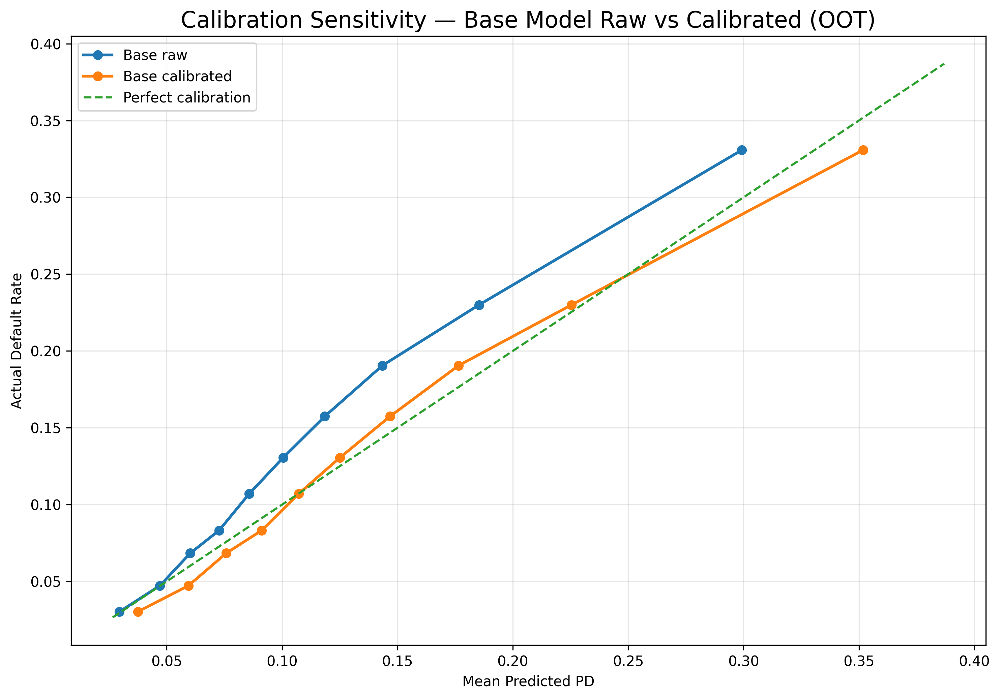
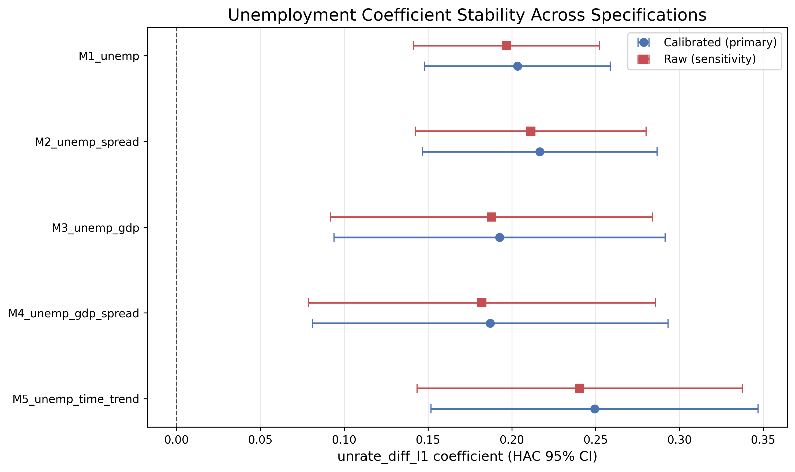
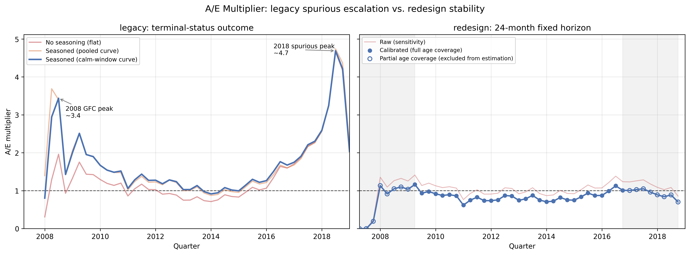
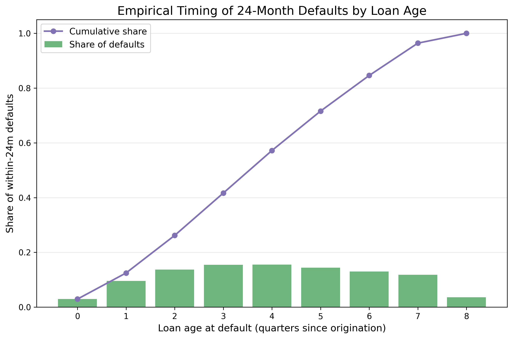

# Credit Stress-Testing Engine

**Loan-level PD → macro satellite → recession scenario engine for consumer-credit losses**

This project builds an end-to-end credit stress-testing framework that connects borrower-level default risk to macroeconomic stress. Using public LendingClub data, the engine estimates 24-month probability of default, calibrates the model to observed portfolio performance, estimates an macro-to-loss transmission channel, and applies historical recession paths to produce stressed default and expected-loss estimates.

The project is model‑risk‑aware: the focus extends beyond the final loss estimate to include leakage control, out‑of‑time validation, calibration, stability testing, and the diagnostic process that corrected an earlier flawed lifetime‑PD design to arrive at the final fixed‑horizon framework.

---


## 1. Project Architecture

The engine has three production components and one diagnostic/model-risk component.

| Component | Notebook | Purpose |
|---|---|---|
| 1. Probability of Default | `01_pd_model.ipynb` | Estimate each loan's 24-month probability of default using origination-time information only. |
| 2. Macro Satellite | `02_macro_satellite.ipynb` | Link realized-vs-expected defaults to macroeconomic conditions through an A/E multiplier. |
| 3. Scenario Engine | `03_scenario_engine.ipynb` | Transmit historical unemployment stress paths through the satellite model to produce stressed default and expected-loss estimates. |
| 4. Model-Risk Journey | `legacy_pd-satellite.ipynb` | An earlier pipeline that produced a false late-cycle stress signal; and documentation of diagnostic tests. |


The final pipeline is:

```text
Origination loan data
        ↓
24-month default target + leakage-safe features
        ↓
Loan-level PD model
        ↓
Validation-based intercept calibration
        ↓
Quarterly actual / expected default multiplier
        ↓
Macro satellite regression
        ↓
Historical recession scenario paths
        ↓
Stressed default rate and expected loss
```

The calibrated PD is the primary reporting basis. The raw PD is retained as a sensitivity. Because the calibration is an intercept-only level adjustment, it changes absolute default levels but not rank ordering or the estimated macro sensitivities.

---


## 2. Executive Results

The final model produces a stable, correctly signed unemployment transmission channel and a transparent stress-loss estimate.

**PD model.** The primary logistic PD model achieves stable out-of-time discrimination: OOT AUC is **0.707**, essentially matching validation AUC of **0.709**. OOT KS is **0.304**. The raw model under-predicts the OOT default rate by about 20%, so an intercept-only validation calibration is applied; after calibration, OOT actual/expected improves from **1.204** to **0.985**.

**Satellite model.** The macro satellite estimates a strong unemployment channel:

> A +1 percentage-point larger quarterly increase in unemployment raises the actual-to-expected default multiplier by approximately 22.6%, implying realized defaults approximately 22.6% above the PD model’s expected baseline, all else equal.

In the primary calibrated M1 specification, the coefficient on lagged change in unemployment is **0.2034** with HAC standard error **0.0282** and **p < 0.001**. The coefficient remains correctly signed and significant across specifications that add credit spreads, GDP growth, and a time trend.

**Scenario engine.** Under a GFC-paced unemployment shock, the peak stress multiplier is **1.33**. Annual expected loss rises from **5.95%** in baseline to **8.10%** in the severe scenario, or from **$59.5M** to **$81.0M** per $1B of exposure. The incremental severe-stress impact is therefore approximately **+$21.4M per $1B**, or **+36%** versus baseline.

**Model-risk contribution.** An earlier lifetime-PD version produced an implausible late-window loss escalation that exceeded the financial-crisis spike. I diagnosed that failure as a dependent-variable construction problem caused by survivorship/truncation bias, not a macro signal or a seasoning artifact. The final version rebuilds the target as a fixed 24-month default outcome, eliminating the false escalation and producing a stable macro-loss channel.

---
<div style="margin-top: 45px;"></div>


## 3. Component 1 — Probability of Default

### 3.1 Data and Outcome Definition

**Data.** The source is the public LendingClub accepted-loans dataset: every loan the
platform funded between 2007 and 2018, 2,260,701 loans across 151 columns. This is an **unsecured, subprime-leaning consumer book** — a materially
higher-default asset class than secured or prime portfolios — which is why the absolute
default and loss levels throughout this report run high by construction and the
*relative* stress sensitivities are the transferable result (§4.3).


| *Data at a Glance* | |  
|---|---|
| Source | LendingClub accepted loans (public) |
| Coverage | 2007Q2 – 2018Q4 issue dates |
| Raw size | 2,260,701 loans × 151 columns |
| Product | Unsecured personal loans, 36/60-month term |
| Outcome field | `loan_status` → fixed 24-month default |

<div style="margin-top: 30px;"></div>

**Outcome.** The target is **`default_24m`**: whether a loan defaults within 24 months of origination. Default is defined using charge-off/default status. Loans without sufficient 24-month follow-up are excluded from model estimation.

This fixed-horizon definition is central to the project. It avoids the bias introduced by terminal-status lifetime outcomes, where late-originated loans are more likely to be unresolved or censored when the data window closes, as occurred in the earlier model design.


The modeling sample is built as follows:

| *Table 1.1a Data Filtering Steps* | |  
|---|---|
| Stage | Loans |
| Raw loans loaded | 2,260,701 |
| (−) Insufficient 24-month follow-up | −938,854 |
| (−) Ambiguous loan status | −10,102 |
| (−) Missing date/status or unresolved timing | −1,187 |
| **Eligible modeling sample** | **1,310,558** (12.79% default) |
| Stratified working sample | 300,000 |

The eligible modeling sample has a 24-month default rate of **12.79%**. The stratified working sample preserves that rate.


### 3.2 Specification and Preprocessing

**Feature selection.** From the 151 raw LendingClub columns, I retain 28 fields for modeling and outcome construction: 25 origination-time predictors, the `loan_status` outcome field, `issue_d`
(used for vintage grouping and the train/validation/OOT split), and `last_pymnt_d`
(carried only to time the outcome).

**The 25 predictors** fall into three categories:

* **Loan terms — 7 variables:** loan amount, term, interest rate, installment, grade, sub-grade, and purpose.
* **Borrower financials — 5 variables:** income, debt-to-income ratio, employment length, home ownership, and income verification status.
* **Backward-looking credit-history attributes — 13 variables:** FICO score, credit-line age, delinquencies, inquiries, open accounts, utilization, public records, bankruptcies, and related bureau counts.

The governing principle of the selection is **conservative leakage control**: any field
whose measurement timing is ambiguous, or which encodes the outcome itself, is dropped.
This removes all post-origination information. A large block of granular
bureau attributes (~60 columns) is excluded on parsimony and ambiguous-timing grounds. The full column-by-
column rationale, including the leakage taxonomy and the redundancy/sparsity exclusions,
is documented separately in **`feature_selection.md`**.


<div style="margin-top: 25px;"></div>

**Model specification.** The PD model is a logistic regression.

The primary specification keeps `int_rate` but excludes LendingClub’s proprietary `grade` and `sub_grade` fields. Two sensitivity specifications test how much model performance depends on the platform’s pricing signal:

* **Primary specification** — keeps `int_rate` and excludes `grade` / `sub_grade`. This relies on contractual pricing and borrower fundamentals rather than LendingClub’s own composite risk score.
* **Sensitivity 1** — drops `int_rate`. This isolates borrower and credit-history fundamentals by removing the pricing signal entirely.
* **Sensitivity 2** — drops `int_rate` and adds `sub_grade`. This substitutes LendingClub’s proprietary risk grade for the contractual interest rate.

Numeric features are median-imputed and standardized. Categorical features are imputed using the most frequent category and one-hot encoded with drop-first encoding. For any numeric field with missingness in the training data, a binary missingness indicator is added.

The two raw FICO bounds, `fico_range_low` and `fico_range_high`, are near-perfectly correlated and are collapsed into a single midpoint feature, `fico_avg`.

All imputation, missingness-indicator construction, encoding, and scaling are fit **inside the modeling pipeline on the training partition only**, then applied unchanged to validation and OOT samples. This is the operative leakage guard: imputation medians, most-frequent categories, missingness patterns, and standardization parameters are learned only from pre-2015 data, so no out-of-time information leaks backward into the model fit.


  
<div style="margin-top: 35px;"></div>

### 3.3 Temporal Validation Split

The split is by loan vintage: **train** (issue date < 2015), **validation** (2015), **out-of-time / OOT** (2016). 

| Split | Rule | Loans | Default rate |
|---|---|---:|---:|
| Train | issue date before 2015 | 106,544 | 11.32% |
| Validation | 2015 issue date | 95,766 | 13.45% |
| Out-of-time | 2016 issue date | 97,690 | 13.75% |


### 3.4 Out-of-time Discrimination

Discrimination and accuracy, primary model:

| Metric | Train | Validation | OOT |
|---|---|---|---|
| AUC | 0.680 | 0.709 | 0.707 |
| Gini | 0.360 | 0.418 | 0.414 |
| KS | 0.261 | 0.307 | 0.304 |
| Brier | 0.096 | 0.110 | 0.111 |

Discrimination is stable out-of-time, confirming the model generalizes across vintages. 

OOT discrimination across specifications:

| Specification | OOT AUC | OOT KS |
|---|---|---|
| Primary | 0.707 | 0.304 |
| Sensitivity 1 (drop int_rate) | 0.694 | 0.283 |
| Sensitivity 2 (drop int_rate, add sub_grade) | 0.706 | 0.303 |

The result does not hinge on any single proprietary signal: dropping `int_rate` costs ~0.013 AUC, and substituting `sub_grade` recovers it — the two are near-substitutes for LC's pricing signal.


### 3.5 Out-of-time Calibration
On OOT, the raw model **under-predicts** default. 


**Calibration by PD decile (OOT, raw / pre-recalibration)** — *Table 1.5b*

| Decile | n | Mean predicted PD | Observed default | A/E ratio |
|---|---|---|---|---|
| 1 (lowest risk) | 9,769 | 2.95% | 3.03% | 1.03 |
| 2 | 9,769 | 4.71% | 4.73% | 1.00 |
| 3 | 9,769 | 6.02% | 6.84% | 1.14 |
| 4 | 9,769 | 7.27% | 8.32% | 1.14 |
| 5 | 9,769 | 8.58% | 10.71% | 1.25 |
| 6 | 9,769 | 10.04% | 13.05% | 1.30 |
| 7 | 9,769 | 11.85% | 15.74% | 1.33 |
| 8 | 9,769 | 14.35% | 19.05% | 1.33 |
| 9 | 9,769 | 18.54% | 23.00% | 1.24 |
| 10 (highest risk) | 9,769 | 29.92% | 33.07% | 1.11 |


The raw A/E exceeds 1.0 in every decile, and is mildest at the extremes, peaking in the mid-book (deciles 6–8). 

<div style="margin-top: 30px;"></div>

#### **Recalibration**
An intercept-only recalibration (a single log-odds shift, `delta_base` ≈ 0.247, fit on the validation set) corrects the overall level of A/E from 1.204 to **0.985** while leaving rank ordering unchanged. 

**Overall calibration (OOT), raw vs. recalibrated** — *Table 1.5a*

| Model | n | Mean predicted PD | Observed default | A/E ratio |
|---|---|---|---|---|
| Base, raw | 97,690 | 11.42% | 13.75% | 1.204 |
| Base, calibrated | 97,690 | 13.97% | 13.75% | 0.985 |


See also: Figure 1.2b. Calibration, Raw vs Calibrated

*Figure 1.2b — Reliability curve for the base model on the out-of-time set, raw vs. calibrated. The raw curve sits above the 45° line (systematic under-prediction); the calibrated curve tracks the diagonal, confirming the intercept recalibration corrects the level without disturbing rank order.*


**The calibrated PD reconciles to the observed default rate and is carried as the primary basis into Components 2–3.** The raw PD is retained as a sensitivity.


---
<div style="margin-top: 40px;"></div>

## 4. Component 2 — Macro Satellite


### 4.1 Actual-to-expected Default Multiplier

Instead of modeling raw default rates, the satellite model uses an actual-to-expected default multiplier as the dependent variable:

```text
A/E multiplier_t = actual defaults_t / expected defaults_t
```

- **Expected defaults** are calculated by allocating each loan’s 24-month predicted default probability across its first eight quarters of life using the empirical default-age curve. Quarterly expected defaults are then obtained by summing these allocated PD amounts across all loans active in that quarter. The expected count thus reflects both portfolio composition and seasoning. 
The empirical default-age curve places most within-24-month defaults between quarters 2 and 7 after origination, with the peak around quarters 4–5. 

- **Actual defaults** are the realized count in quarter *t*.

The multiplier has a clear interpretation:
- **m_t ≈ 1**: realized defaults match the PD model's expectation;
- **m_t > 1**: realized defaults are worse than expected;
- **m_t < 1**: realized defaults are better than expected.

**The satellite regression then regresses log of the multiplier on macro variables**.


### 4.2 Quarterly Data

The satellite is estimated on the full eligible set of 1,310,558 scored loans, aggregated to a calendar-quarter panel spanning 2007Q2–2018Q4.

For each calendar quarter, the A/E multiplier is calculated: 
- The **multiplier** = actual / expected defaults.

Quarterly macro inputs are obtained from standard FRED series: 
- the unemployment rate (UNRATE)
- real GDP growth (year-over-year)
- the BAA–10-year Treasury credit spread

Each series is aligned to the loan panel's calendar quarters and entered with a one-quarter lag, so the satellite explains a quarter's loss experience using macro conditions known at the start of it. Unemployment and the credit spread are entered in differences rather than levels, consistent with its near-unit-root behavior over the sample. 

Of the 47 quarters from the full data (2007Q2–2018Q4), the regression uses the 31 "full-age-mix" quarters (2009Q2–2016Q4) in which every loan-age 0–8 is represented; the 16 partial-coverage edge quarters are excluded from estimation to avoid the thin-data distortion in the expected-default denominator.


### 4.3 Satellite Specification

The satellite regression is estimated by **ordinary least squares** on the log
multiplier.

Because the panel is a 31-quarter time series, the residuals are
serially correlated and the constructed multiplier is heteroskedastic across quarters. Classical OLS standard errors would be understated. The model therefore uses **Newey-West (HAC) standard errors with one lag**
(`maxlags = 1`), which are robust to both heteroskedasticity and first-order
autocorrelation. All reported t-statistics,
p-values, and confidence intervals are HAC-based; the point estimates are the OLS estimates.

The model is run in **five specifications (M1–M5)**:
- lagged change in unemployment only;
- unemployment change + credit-spread change;
- unemployment change + real GDP growth;
- unemployment change + both spread and GDP;
- unemployment change + a linear time trend.

The dependent variable is the log calibrated multiplier. Raw-PD multipliers are carried as a sensitivity.


<div style="margin-top: 35px;"></div>

### 4.4 Results

The main result is a robust transmission channel from **the change in unemployment** to credit losses. 


**Table 2.3 — Satellite regression results (M1–M5, calibrated, 2009Q2–2016Q4, n=31)**

| Regressor | M1 | M2 | M3 | M4 | M5 |
|---|---|---|---|---|---|
| Δ Unemployment (lag 1) | 0.203*** | 0.217*** | 0.193*** | 0.187*** | 0.249*** |
|  | (0.028) | (0.036) | (0.050) | (0.054) | (0.050) |
| Δ Credit spread (lag 1) | — | 0.024 | — | 0.044 | — |
|  |  | (0.043) |  | (0.073) |  |
| GDP growth (lag 1) | — | — | −0.286 | −1.085 | — |
|  |  |  | (1.089) | (2.008) |  |
| Time trend | — | — | — | — | 0.005 |
|  |  |  |  |  | (0.003) |
| Constant | −0.157*** | −0.154*** | −0.153*** | −0.136*** | −0.228*** |
|  | (0.023) | (0.023) | (0.024) | (0.040) | (0.050) |
| | | | | | |
| R² | 0.328 | 0.332 | 0.329 | 0.338 | 0.415 |
| Adj. R² | 0.305 | 0.284 | 0.281 | 0.264 | 0.373 |
| AIC | −43.7 | −41.9 | −41.7 | −40.1 | −46.0 |

\*\*\* p<0.001. 

Dependent variable: log A/E multiplier. HAC (Newey-West, 1 lag) standard errors in parentheses.

Specifications: M1 unemployment only; M2 +credit spread; M3 +GDP growth; M4 +spread +GDP; M5 +linear time trend.


**The change in unemployment is significant across all five satellite  
specifications.** 
Its coefficient is stable in a tight band — 0.187 to 0.249 — across the addition of credit spread, GDP
growth, both together, and a linear time trend, and it is largest under the trend control
(M5, 0.249), confirming the channel is not an artifact of a secular drift in the multiplier.
Credit spread and GDP growth are statistically insignificant. 

The unemployment coefficient is
also near-identical on the raw-PD basis (0.197–0.241 across M1–M5), confirming invariance
to the calibration choice.


In the primary specification (M1, calibrated), 
> **β(Δunemployment, lag 1) = +0.2034**.<br>
> Semi-elasticity: exp(0.2034) ≈ **1.226** — a +1pp larger rise in unemployment scales the A/E multiplier by ~**22.6%**.


Also see: Figure 2.2.: across all five specifications the unemployment coefficient stays in a tight positive band with every 95% interval clear of zero, and the calibrated and raw estimates are nearly coincident.


*Figure 2.2 — The unemployment coefficient (Δunemployment, lag 1) across the five specifications, calibrated (primary) vs. raw (sensitivity), with HAC 95% confidence intervals.*

---
<div style="margin-top: 40px;"></div>


## 5. Component 3 — Scenario Engine

### 5.1 Scenarios

Three scenarios are transmitted through the estimated channel. Stress paths use the **actual end-of-quarter unemployment trajectories** (from FRED) of two historical episodes, matching the satellite's own end-of-quarter construction:

- **Calm / baseline** — flat unemployment at 4.0%.
- **Adverse** — the 2001 recession profile (peak unemployment ~6.1%).
- **Severely adverse** — the 2008–09 financial-crisis profile (peak ~8.9%).

Each scenario's quarterly unemployment changes are passed through β to produce a per-quarter stress multiplier; the peak multiplier is applied to every loan's calibrated PD. Annual-equivalent rates are the primary reporting basis (per-loan constant-hazard annualization, annual = 1 − (1 − PD₂₄ₘ)^0.5), with 24-month cumulative retained as reference.

Only unemployment is transmitted, because it is the only macro variable the satellite found to be a significant driver across all specifications. The engine therefore transmits the one robust channel and reports the result as an explicit single-channel lower bound.


### 5.2 Results

Peak stress multipliers: baseline 1.00, adverse 1.15, **severe 1.33**.

**Portfolio default rate (annual primary; 24-month cumulative in parentheses):**

| Scenario | Annual default | 24-month | vs baseline |
|---|---|---|---|
| Baseline | 7.26%/yr | 13.76% | — |
| Adverse | 8.45%/yr | 15.86% | +16.4% |
| Severe | 9.86%/yr | 18.29% | +35.8% |

**Expected loss:**

Expected loss uses:
- calibrated 24-month PD as the primary basis;
- flat illustrative LGD = **0.80**;
- original loan amount as the EAD proxy.

| Scenario | Annual EL | per $1B | incremental |
|---|---|---|---|
| Baseline | 5.95%/yr | $59.5M | — |
| Adverse | 6.93%/yr | $69.3M | +$9.8M (+16.5%) |
| Severe | 8.10%/yr | $81.0M | +$21.4M (+36.0%) |

The baseline 24-month default of 13.76% reconciles to the observed book rate (calibration A/E ≈ 0.985), so the absolute levels are anchored to reality rather than under-stated. 

**A GFC-paced unemployment shock raises annual expected loss by ~36% (~+$21.4M per $1B of exposure)** through the single unemployment channel.


### 5.3 Realism and Scope


The severe-scenario result should be read as a **single-channel lower bound**, not as a fully tuned CCAR-style stress forecast. It isolates the unemployment channel because that is the robust empirical channel in this public-data sample.

The absolute levels reflect an **unsecured, subprime-leaning consumer book** — high by construction for that asset class — so the **portable result is the relative stress sensitivity**. 

A full production model would likely include additional channels:
- credit spreads;
- GDP or income shocks;
- borrower-level transitions over time;
- time-varying LGD;
- exposure amortization and utilization dynamics;
- correlated tail effects across PD, LGD, and EAD.

---
<div style="margin-top: 35px;"></div>


## 6. Model-risk Journey: Diagnosis and Resolution

The earlier version of the project used a **terminal-status, lifetime-PD** outcome, for loans with resolved terminal status only. 

Its A/E multiplier responded correctly to the 2008–09 crisis (peak ≈ 3.4) but then **escalated without a macro cause** from 2015, reaching ≈ 4.7 by 2018 — implausibly implying that a calm, low-unemployment period was a worse credit event than the financial crisis.

### Diagnostic tests

I tested whether the escalation could be explained by seasoning. The diagnostic notebook examined realized default behavior over calendar time within fixed loan-age bands and applied seasoning adjustments two ways:
- a pooled empirical age curve;
- a calm-window age curve.

The result was decisive: the late-window escalation remained after seasoning adjustment. At the 2018Q3 peak, the multiplier was approximately:
- **4.66** without seasoning adjustment;
- **4.74** using the pooled age curve;
- **4.69** using the calm-window age curve.

Seasoning was not the root cause of the escalation.

The problem was upstream: the dependent variable itself was biased. The terminal-status, resolved-only lifetime outcome admitted survivorship/truncation bias as the data window closed. Late-originated loans that were resolved were not representative of the full population, causing the realized hazard and A/E multiplier to rise for mechanical reasons unrelated to macro conditions.

### Redesign

The final version rebuilds the target as **a fixed 24-month default outcome**:
- each loan is evaluated over the same performance window;
- loans without sufficient follow-up are excluded;
- the outcome is comparable across vintages;
- the satellite model receives a cleaner dependent variable.

The fixed horizon eliminates the survivorship/truncation bias structurally: there is no longer a resolved-only subpopulation whose composition shifts as the data window closes, so the realized hazard in the late quarters reflects genuine credit experience rather than a changing observation set. The result is decisive. Over the *same* calendar window that produced the legacy escalation, the redesigned multiplier oscillates near 1.0 with no spurious climb — including in 2017–2018, where the legacy version had reached ~4.7. With the construction artifact gone, the underlying macro signal is no longer masked by it: the robust, correctly-signed unemployment channel emerges cleanly. 


**Table — A/E multiplier path, legacy vs. redesign**

| Quarter | Legacy | Redesign | Quarter | Legacy | Redesign |
|---|---|---|---|---|---|
| 2008Q2 | 2.94 | 0.91 | 2013Q4 | 0.98 | 0.75 |
| 2008Q3 | 3.44 | 1.05 | 2014Q1 | 0.92 | 0.71 |
| 2008Q4 | 1.43 | 1.10 | 2014Q2 | 0.94 | 0.72 |
| 2009Q1 | 2.01 | 1.04 | 2014Q3 | 1.08 | 0.82 |
| 2009Q2 | 2.51 | 1.16 | 2014Q4 | 1.02 | 0.76 |
| 2009Q3 | 1.95 | 0.93 | 2015Q1 | 1.00 | 0.75 |
| 2009Q4 | 1.90 | 0.98 | 2015Q2 | 1.14 | 0.84 |
| 2010Q1 | 1.67 | 0.92 | 2015Q3 | 1.30 | 0.94 |
| 2010Q2 | 1.54 | 0.87 | 2015Q4 | 1.22 | 0.87 |
| 2010Q3 | 1.49 | 0.89 | 2016Q1 | 1.26 | 0.87 |
| 2010Q4 | 1.52 | 0.86 | 2016Q2 | 1.50 | 0.99 |
| 2011Q1 | 1.06 | 0.62 | 2016Q3 | 1.76 | 1.13 |
| 2011Q2 | 1.29 | 0.75 | 2016Q4 | 1.67 | 1.01 |
| 2011Q3 | 1.44 | 0.83 | 2017Q1 | 1.75 | 1.00 |
| 2011Q4 | 1.27 | 0.74 | 2017Q2 | 1.91 | 1.03 |
| 2012Q1 | 1.28 | 0.74 | 2017Q3 | 2.21 | 1.05 |
| 2012Q2 | 1.18 | 0.76 | 2017Q4 | 2.30 | 0.96 |
| 2012Q3 | 1.28 | 0.87 | 2018Q1 | 2.59 | 0.89 |
| 2012Q4 | 1.24 | 0.86 | 2018Q2 | 3.24 | 0.84 |
| 2013Q1 | 1.03 | 0.74 | 2018Q3 | **4.69** | **0.89** |
| 2013Q2 | 1.03 | 0.79 | 2018Q4 | 4.21 | 0.70 |
| 2013Q3 | 1.13 | 0.88 |  |  |  |

*The legacy series escalates monotonically to 4.69 by 2018Q3 while the redesign holds near 1.0 over the identical window.*


See also: 
**Figure L.1**. 

*Figure L.1 — A/E multiplier, legacy vs. redesign. The legacy terminal-status multiplier escalates to ~4.7 by 2018; over the same window the redesign's 24-month fixed-horizon multiplier stays near 1.0. Open markers denote partial-coverage quarters excluded from estimation. Shared axes.*

<div style="margin-top: 30px;"></div>

### 24-months horizon
The 24-month horizon is justified empirically by the fact that efaults concentrate in the first two years after origination: the hazard rises through the first year, peaks around quarters 3–4, and tapers thereafter, with the cumulative share of within-24-month defaults reaching essentially its full level by quarter 8. A fixed 24-month window therefore captures the bulk of the credit risk that materializes over a loan's life while ensuring every loan in the sample is observed over an identical, fully-matured horizon. This is what makes the outcome comparable across vintages and free of the survivorship/truncation bias that a terminal-status, variable-horizon definition introduces.

See **Figure 1.4**. 

*Figure 1.4 — Empirical timing of 24-month defaults by loan age. Defaults concentrate in the first two years, with the cumulative share reaching its full level by quarter 8.*


---
<div style="margin-top: 35px;"></div>


## 7. Limitations and Extensions

* **Public data and asset-class scope.** LendingClub is an unsecured consumer-credit book with a subprime-leaning risk profile. Absolute default and loss levels are therefore asset-class-specific; the more transferable result is the relative stress sensitivity of losses to macro conditions.

* **Limited and dated macro-history window.** The satellite model is estimated on a relatively short quarterly time series and on an older LendingClub sample. This limits statistical power, and makes multi-factor macro estimation difficult.

* **Default-timing approximation.** Default timing is inferred from the available LendingClub status and timing fields rather than observed from a complete servicing-performance history. The resulting default quarter should be interpreted as an approximation rather than a precise event date.

* **Eligibility and ambiguous-status exclusions.** Loans without a clean 24-month performance window or with ambiguous status/timing information are excluded from the modeling sample. This improves outcome validity, but it also reduces sample coverage and may remove some borderline cases that a production servicing dataset could resolve more precisely.

* **Single macro channel.** The satellite transmits stress through unemployment only. Credit spread and GDP growth are reported as honest nulls in this sample rather than forced into the model. A richer production model with more history, more crisis observations, or additional borrower/portfolio segmentation would likely support a multi-factor transmission and could raise the severe-stress sensitivity above the current single-channel lower bound.

* **Flat illustrative LGD.** Loss given default is fixed at an illustrative 0.80 rather than estimated empirically or made stress-sensitive. A natural extension would estimate LGD directly and allow it to vary with macro conditions, collateral values, recovery environment, or loan characteristics.

* **Simplified EAD.** Exposure at default is proxied by original loan amount, with no amortization, prepayment, utilization, or exposure-at-default modeling. A production implementation would model outstanding balance at default more precisely.

* **Interpretable scorecard rather than maximum-performance ML.** The PD layer uses a leakage-safe, interpretable logistic-regression framework. This supports transparency and model-risk documentation, but it likely leaves some discrimination gains on the table relative to a tuned gradient-boosting or ensemble model over a richer bureau-feature set.

* **Scenario design is historical and stylized.** The adverse and severely adverse scenarios use historical unemployment paths rather than a full regulatory scenario with internally consistent paths for unemployment, GDP, rates, spreads, house prices, and borrower income. The resulting scenario outputs should be read as controlled stress-transmission estimates, not as a complete capital forecast.


---

## Appendix — List of Tables and Figures

All tables and figures are generated directly by the project notebooks and written to component-specific artifact folders.

### Component 1

All tables and figures below are written to `artifacts_component1/`.

**Tables**

- **Table 1.1a** — Cohort waterfall (data filtering steps)
- **Table 1.1b** — Partition summary (train/validation/OOT)
- **Table 1.2** — Variable dictionary
- **Table 1.3a** — Coefficients across specifications
- **Table 1.3b** — Odds ratios across specifications
- **Table 1.4** — Discrimination and accuracy across splits
- **Table 1.5a** — Calibration (OOT) overall summary
- **Table 1.5b** — Calibration (OOT) by decile (base model)

**Figures**

- **Figure 1.1a** — ROC by split (primary model)
- **Figure 1.1b** — ROC by model specification (OOT)
- **Figure 1.2a** — Calibration overlay, three specs (OOT)
- **Figure 1.2b** — Calibration, base raw vs. calibrated (OOT)
- **Figure 1.3** — Rank ordering: observed default rate by PD decile (OOT)
- **Figure 1.4** — Empirical timing of 24-month defaults by loan age

### Component 2

All tables and figures below are written to `artifacts_component2/`.

**Tables**

- **Table 2.1** — Empirical default-age curve
- **Table 2.2** — Quarterly A/E multiplier path
- **Table 2.3** — Satellite coefficient table (baseline, calibrated primary)
- **Table 2.3b** — Unemployment-coefficient focus (calibrated vs. raw, M1–M5)
- **Table 2.4** — Model comparison (baseline, calibrated primary)

**Figures**

- **Figure 2.1** — Multiplier path over time (clean quarters; partial-coverage flagged)
- **Figure 2.2** — Coefficient stability (unemployment, M1–M5; calibrated vs. raw)
- **Figure 2.3** — Multiplier vs. unemployment scatter (calibrated)

### Component 3

All tables and figures below are written to `artifacts_component3/`.

**Tables**

- **Table 3.1** — Scenario unemployment paths
- **Table 3.2** — Stress multiplier paths
- **Table 3.3** — Scenario summary

**Figures**

- **Figure 3.1** — Scenario unemployment paths
- **Figure 3.2** — Stress multiplier paths by scenario
- **Figure 3.3** — Annual default rate by scenario
- **Figure 3.4** — Annual expected loss by scenario

### Legacy

Notebook in `legacy/`.

**Figures**

- **Figure L.1** — Multiplier paths contrast: legacy vs. redesign
